# Естетична Клиника - Spring MVC Приложение

Проектът представлява уебсайт за естетична клиника и предлага лесен начин за запазване и преглед на часове от клиенти и потвърждаване на консултации от лекар. Сайтът е разработен с цел улесняване на потребителите и оптимизиране процеса на резервация и управление на часовете.

## Технологичен стек
1. **Java 17**
2. **JavaScript**
3. **Thymeleaf**
4. **HTML**
5. **CSS**
6. **Gradle**

Всички останали зависимости и библиотеки могат да се видят в `build.gradle` файла.

## Конфигурация и Стартиране

### Външно API
**[API за валутните курсове](https://www.exchangerate-api.com/)**
  - Това API предоставя информация за валутните курсове, като чрез него цените на процедурите, показани в евро, са винаги актуални.
  - За да се използва, трябва да се направи регистрация и да се вземе ключ.
  - Добавя се ключа като environment variable в средата за разработка като `EXCHANGE_RATE_API_KEY`.

### Вътрешно API
Проектът включва и собствен микросървис. Необходимо е да се добави environment variable `FEEDBACKS_API_KEY` със стойност, съвпадаща с ключа на API-то. Повече информация може да се види [тук](https://github.com/Aleksandra-Ilieva/SoftniFeedbackMicroservice).

### Environment Variables
За стартиране на проекта са нужни следните environment variables, отговарящи на съответните конфигурации в [application.properties](src%2Fmain%2Fresources%2Fapplication.properties):

- `db_username` -> `spring.datasource.username`
- `db_password` -> `spring.datasource.password`
- `db_dataUrl` -> `spring.datasource.url`
- `email` -> `spring.mail.username`
- `email_password` -> `spring.mail.password`
- `EXCHANGE_RATE_API_KEY` -> ключ за външното API
- `FEEDBACKS_API_KEY` -> ключ за вътрешното API
### Active Profiles
Active profiles -> dev

## Конфигурация за базата данни
За връзка с базата данни:
````
spring.datasource.username=${db_username}
spring.datasource.password=${db_password}
spring.datasource.url=${db_dataUrl}/clinic?useSSL=true&createDatabaseIfNotExist=true

````
Пример за локален url -> jdbc:mysql://localhost:3306

Ако не се използва MySQL, е необходимо да се променят следните настройки в application.properties, за да съответстват на базата данни, която се използва:
```
spring.datasource.driverClassName
spring.datasource.url
spring.jpa.properties.hibernate.dialect

```

## Конфигурация за автоматичното изпращане на имейли
Приложението има имплементирана функционалност за автоматично изпращане на имейли. В environment variables се посочва от кой имейл се изпраща съобщението, а за парола се слага специален код, който се генерира (Ако се използва Gmail, първо трябва да се активира двуфакторна автентикация).
````
spring.mail.username=${email}
spring.mail.password=${email_password}

````
Ако не се използва Gmail, е необходимо да се променят следните настройки в application.properties:
````

spring.mail.host
spring.mail.port
spring.mail.username
spring.mail.password
spring.mail.properties.mail.smtp.auth
spring.mail.properties.mail.smtp.starttls.enable

````

## Стартиране на Приложението
Приложението работи на локален сървър на порт **8080**.
За стартиране се изпълняват следните стъпки:

1. Конфигуриране на **environment variables**, както е описано по-горе.
2. Билдване с gradle.
3. Стартиране през IDE.
4. Отворяне на `http://localhost:8080` в браузър.


# За проекта
### Начална страница
Това е началната страница, която всеки потребител, включително нерегистриран, може да достъпи. Тя съдържа навигационно меню, секции и footer. Чрез бутона bn/en, потребителят може да избира между български или английски език.
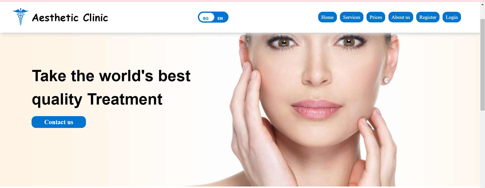

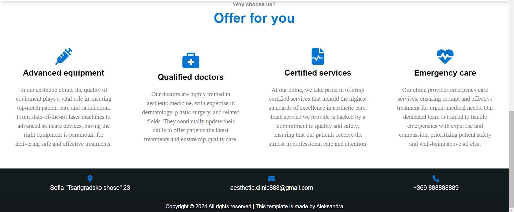


### Страница с Услуги
Това е страницата с услугите, която може да бъде достъпена от всеки потребител, включително нерегистриран. В нея се виждат услугите, които клиниката предлага.

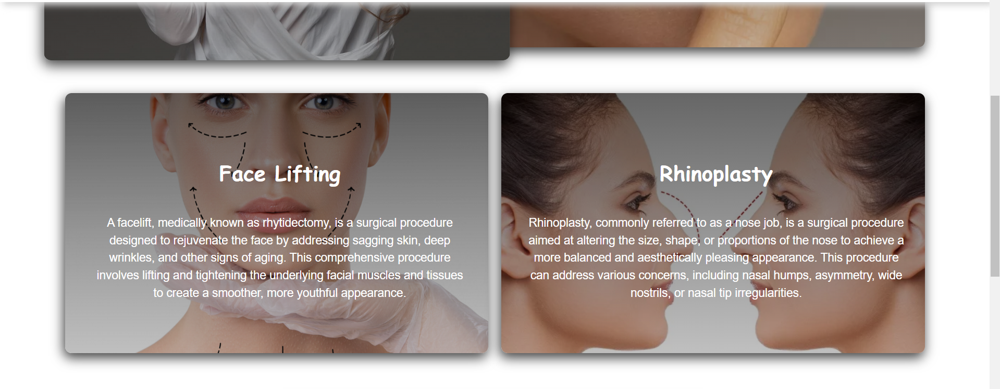
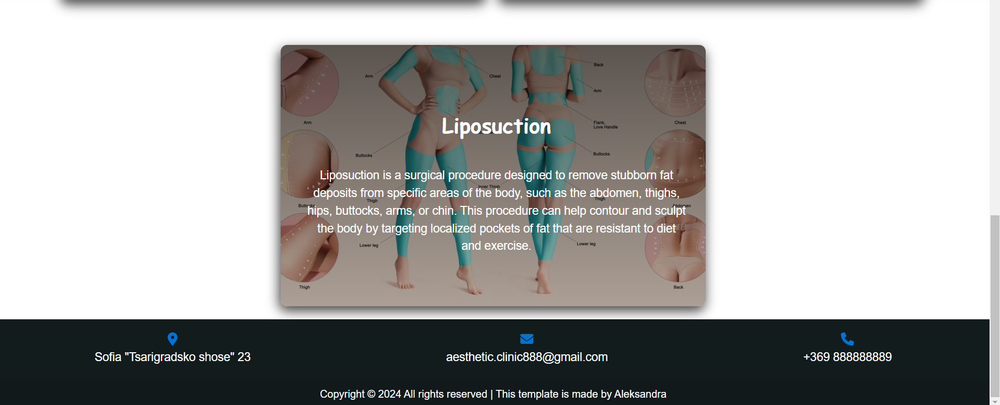

### Страница с Цени
Ценовата страница може да бъде достъпена от всеки потребител, включително нерегистриран. В страницата са показани цените на услугите, които се съхраняват в базата данни. При стартиране на приложението се чете CSV файл, който се намира в ресурсите на проекта. Цените са посочени в долари, като за трансформацията им от долари в евро се използва API, споменато по-рано: **[API за валутните курсове](https://www.exchangerate-api.com/)**.
Всеки ден в 12:00 часа, с помощта на scheduler-а "ExchangeRateUpdaterScheduler", се изпращат заявки към API-то и се обновява информацията за валутните курсове в базата данни.
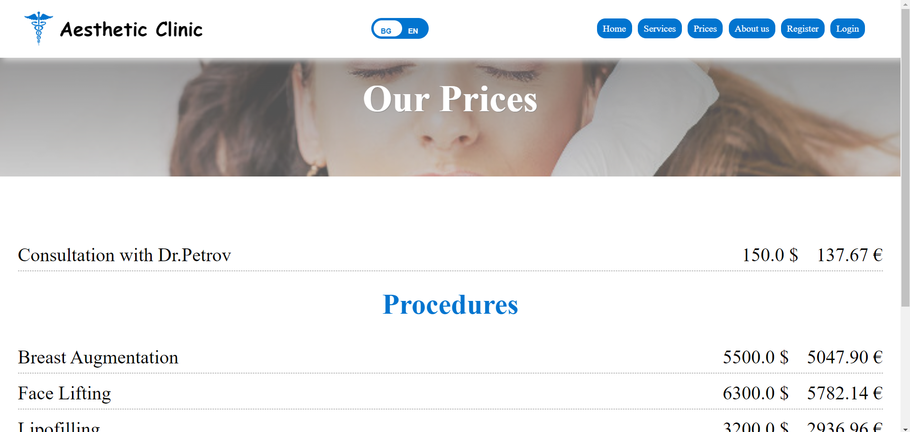
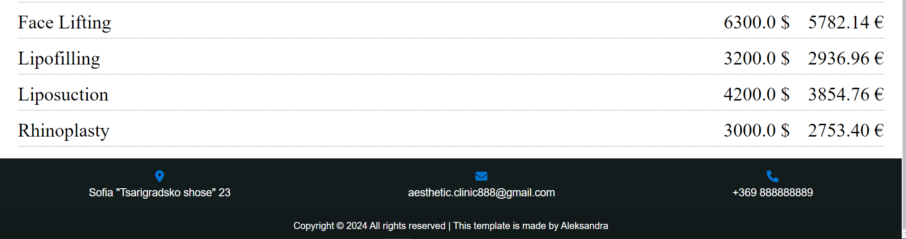

### Страница За Нас
Това е информационна страница, която може да бъде достъпена от всеки потребител ,включително нерегистриран. В нея може да се види повече информация за клиниката.


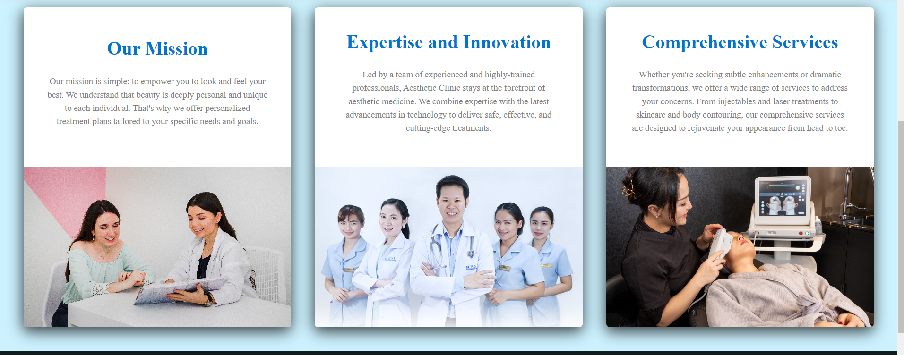

### Страница за Регистрация

Потребителят се регистрира в сайта чрез следната форма. Валидациите се извършват както на Frontend, така и на Backend ниво.

#### Frontend валидации:
- HTML формата проверява дали полетата не са празни.
- HTML формата валидира коректността на имейла.

#### Backend валидации:
- Валидира се коректността на имейла.
- Проверява се дали вече няма съществуващ регистриран имейл или потребителско име.
- Проверява се за нулеви стойности и празни полета.
- Проверява се за еднаквост на паролата и потърдената такава.
  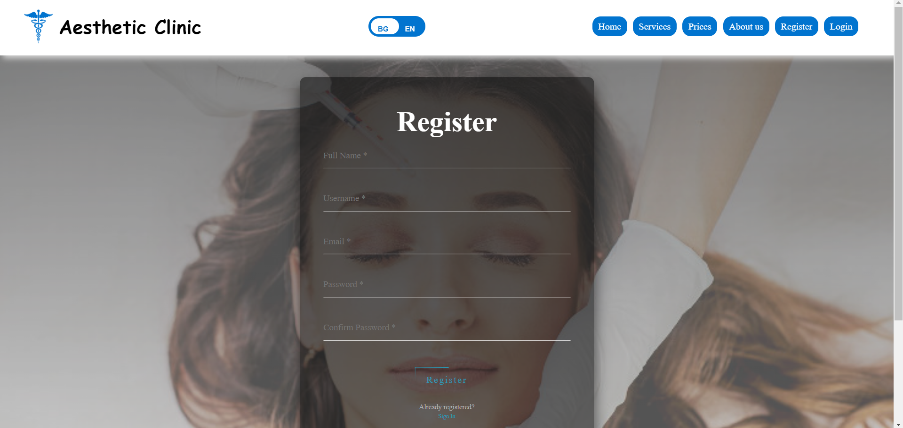
  Пример за валидация чрез анотация, която проверява за вече регистрирано потребителско име:
  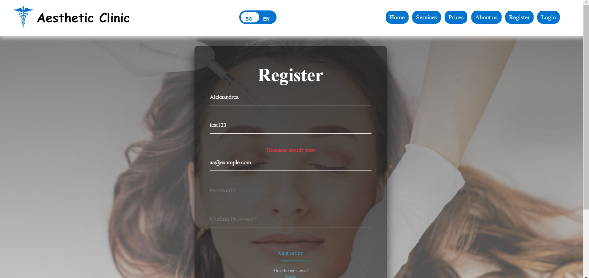

### Страница за Вход

След регистрация, потребителят се пренасочва към формата за вход, чрез която може да влезе с имейл и парола.


#### Автентикация със Spring Security

Автентикацията на потребителя се извършва с помощта на Spring Security, конфигурирана е в `src/main/java/org/example/softunifinalproject/config/SecurityConfig.java`. При грешна парола или имейл се получава следното съобщение:

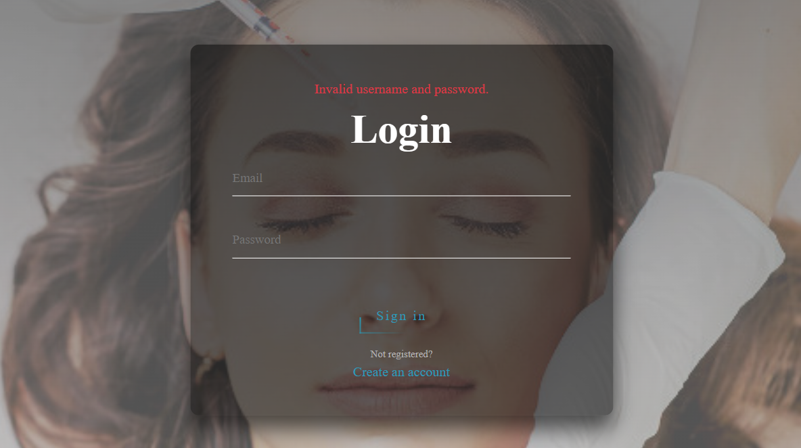

#### Регистрация на Администраторски Потребител

При стартиране на приложението, в базата данни се регистрира един потребител с администраторски права, който получава всички роли. Данните за този администратор и ролите се задават в `src/main/java/org/example/softunifinalproject/init/DbInitAdminAndRoles.java`. Тази конфигурация осигурява запазването в базата на администратора и всички роли, ако вече не са били създадени.


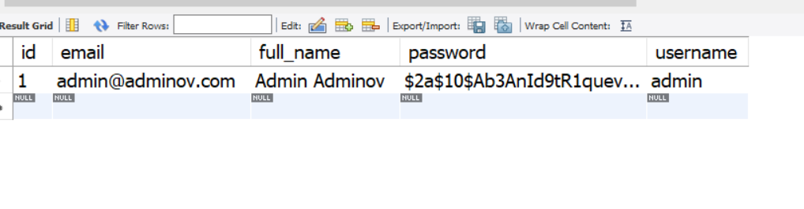
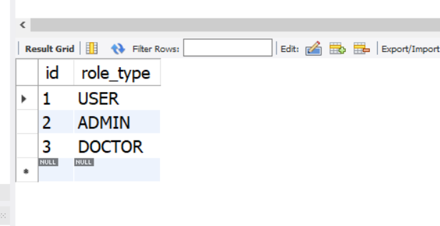

При регистриране нов потребител в приложението, той автоматично получава само роля `USER`. За демонстрация, потребител с имейл `aleks_5@abv.bg` ще бъде регистриран.

## Вход като Администратор
След успешен вход, администраторът получава достъп до административния панел, от който може да извършва различни действия.
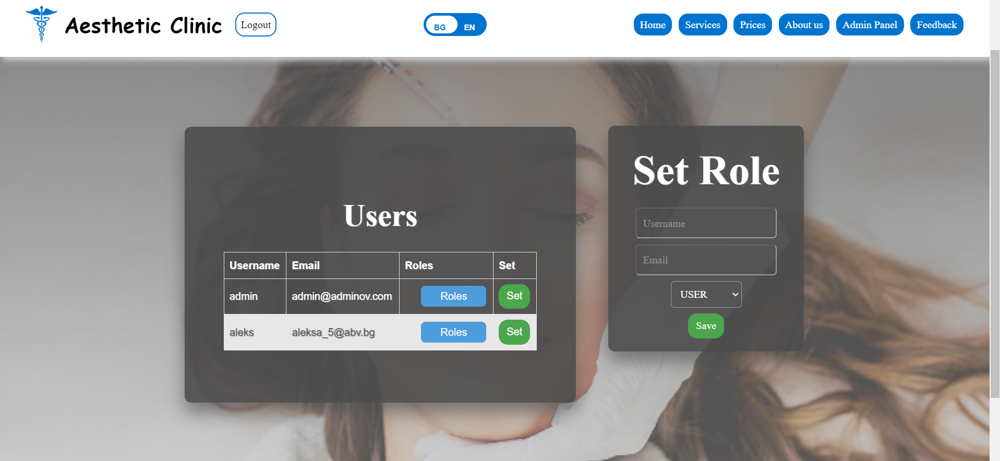
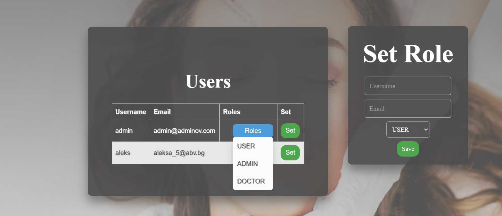
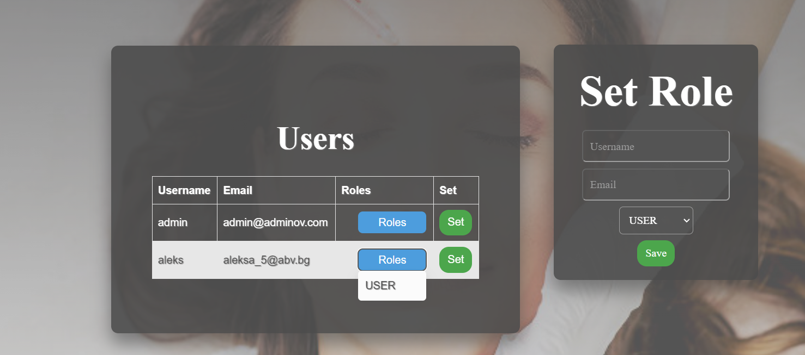

### Регистриране на Потребител с Роля Доктор

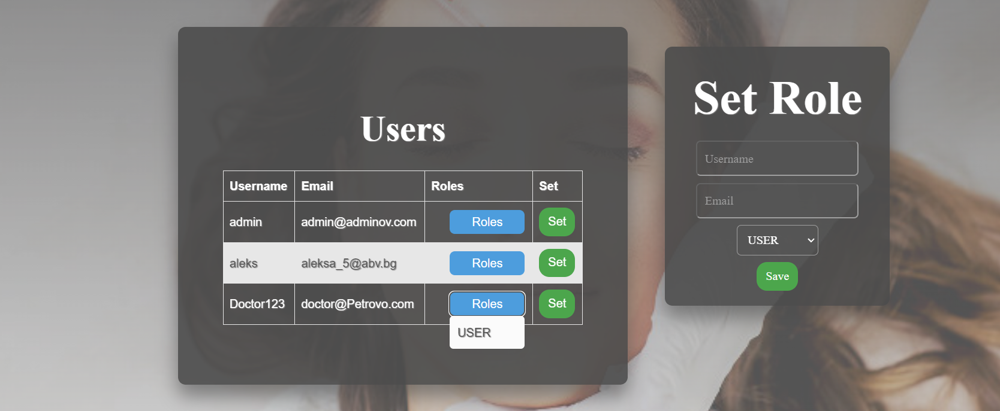

Администраторът може да задава роли. За да се зададе роля на нов потребител, администраторът трябва да въведе името и имейла на потребителя и да избере желаната роля. След натискане на бутона за запазване, ролята е успешно зададена на потребителя.

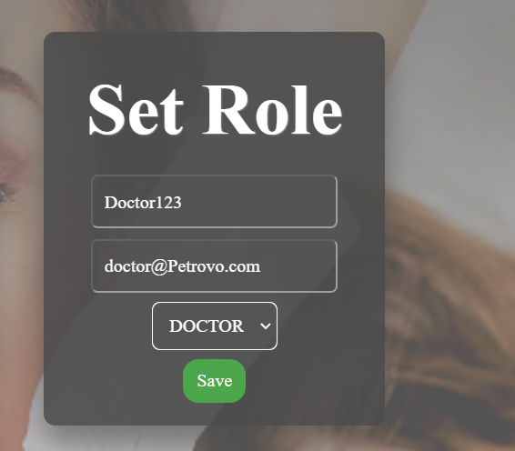
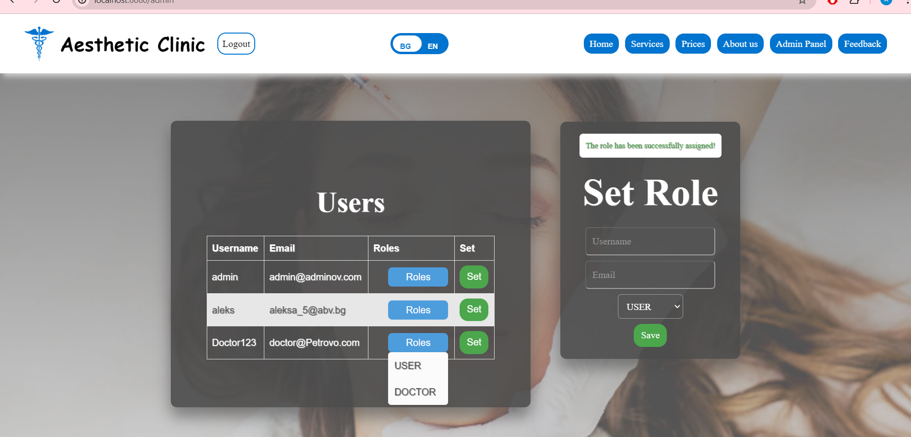
### Валидации
#### Валидация за Съществуваща Роля
При опит за задаване на роля, която вече потребителят има, се показва съответното съобщение за грешка.

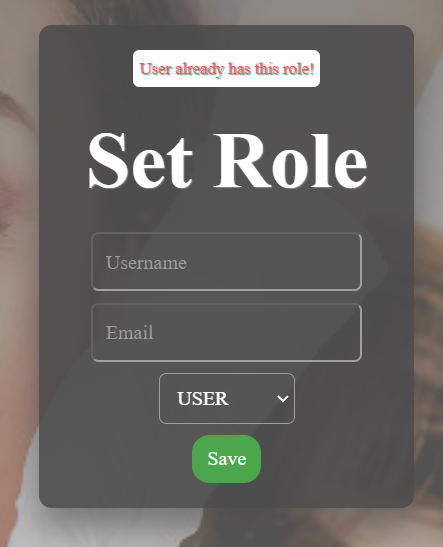

#### Валидация за Грешен Имейл или Потребителско има
При неправилен имейл или потрбителско име, се показва съобщение за грешка.


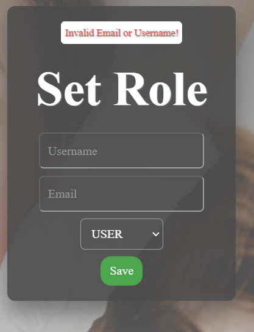

## Вход като  Потребител с роля USER
Потребителят може да запази час. Процесът на резервация включва следните валидации, извършвани чрез анотации и JavaScript:
- **Дата**: Трябва да бъде текущата дата или в бъдещето.
- **Работни дни**: Датата трябва да бъде в делничен ден.
- **Час**: Трябва да бъде между 9:00 и 18:00.
- **Преглед на наличните часове**: Потребителят може да види всички запазени часове за следващите 5 дни, както своите, така и на останалите потребители, за да избере подходящ незапазен час.
- **Продължителност на запазен час**: 30 минути.
- **Максимален брой запазени часове**: Потребителят може да има до 3 запазени часа.

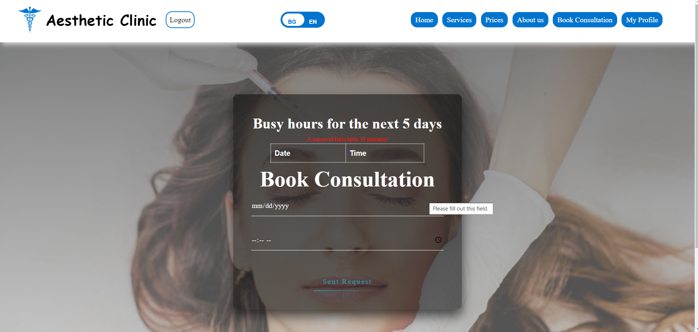

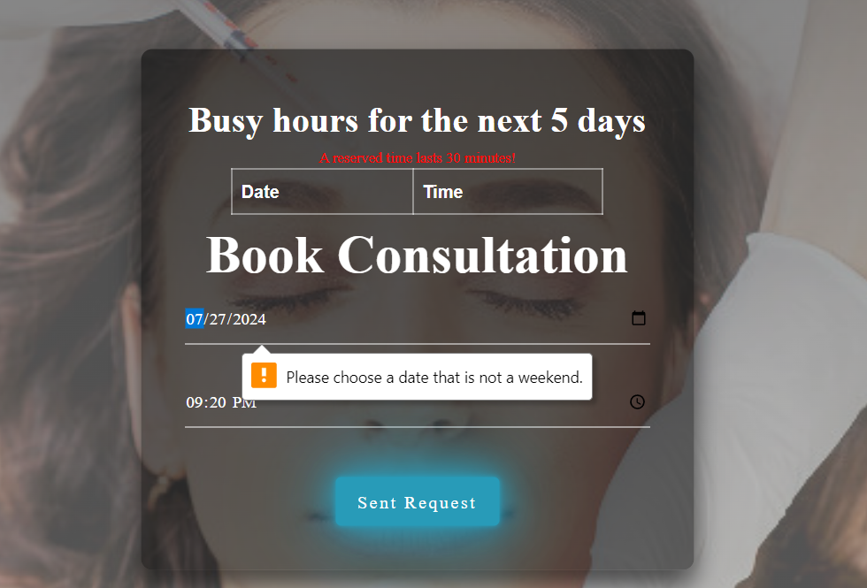

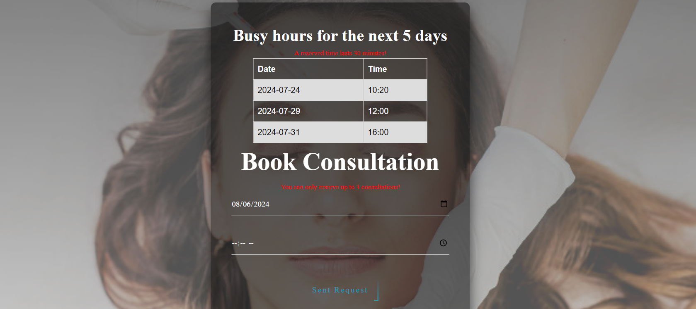
### Успешна Заявка за Час
След успешното изпращане на заявка за час, докторът получава известие и има възможност да одобри или откаже заявката.


## Вход като Доктор
След като потребителят е изпратил заявка за час, докторът може да я одобри или откаже. Потребителят ще получи автоматичен имейл с уведомление за състоянието на заявката.
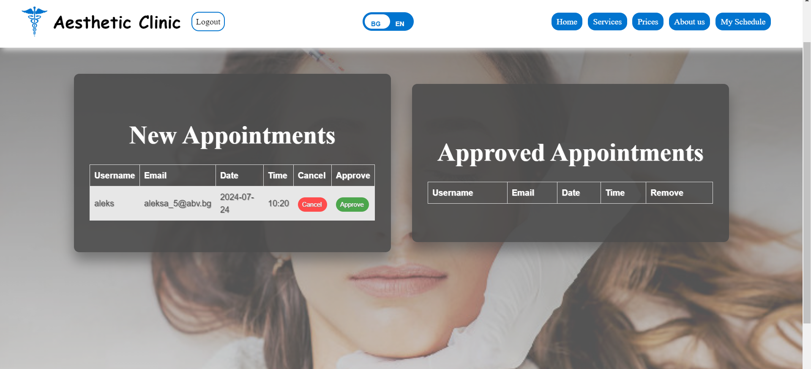
- **Отказ**: При отказ, заявката се изтрива и не може да бъде обработвана повече.
- **Одобрение**: След одобрение на заявката:


## Вход като  Потребител с роля USER
След одобрение на заявка за час от страна на доктора, потребителят може да види своите запазени часове.


### Страница „Моят Профил“
В страницата „Моят Профил“ потребителят може да види своите запазени часове и има възможност да откаже час до 2 часа преди началото на съответната резервация.


### Успешно Отказан Час
Когато часът бъде успешно отказан, потребителят получава потвърждение за успешното анулиране.


## Вход като Лекар
При клик на бутона „Консултиран“, записът се маркира като приключен и се премахва от интерфейса, но не се изтрива веднага от базата данни. Записите се изтриват автоматично от базата данни на всеки 2 часа с помощта scheduler.

Настройките за автоматично почистване на консултирани записи се управляват в `src/main/java/org/example/softunifinalproject/config/CleanupScheduler.java`.


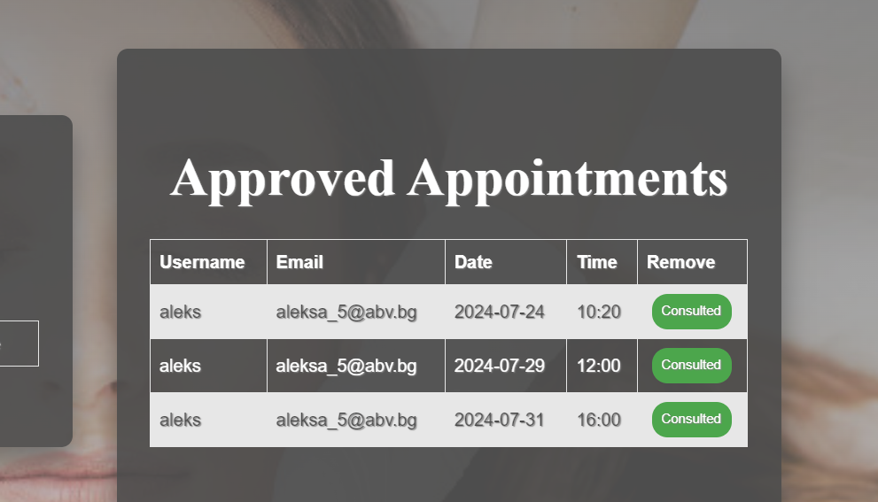


### Страница „Контакт с Нас“
- **Форма за Запитване от Гости**: Всеки потребител, включително и нерегистриран, може да изпрати запитване, след като попълни формата.
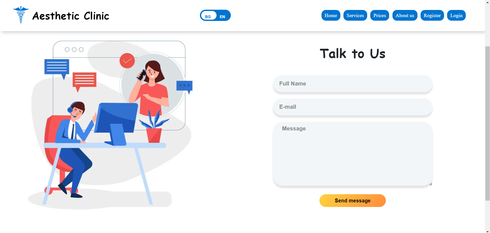

- **Автоматично Попълване на Имейл**: Ако потребителят има акаунт и е вписан, неговият имейл адрес се попълва автоматично в съответното поле на формата.

  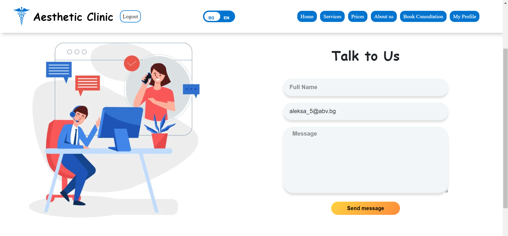

- **Успешно Изпратено Съобщение**: След успешно изпращане на съобщението, потребителят получава потвърждение.
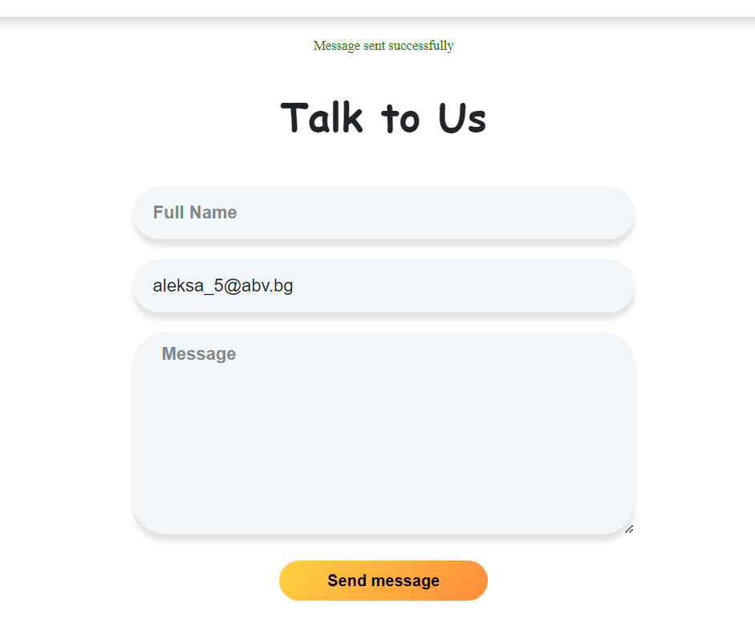

## Вход като Администратор

Запитванията, изпратени чрез страницата „Контакт с Нас“, се обработват от микросървиса, който беше споменат по-рано.

### Управление на Запитвания

Администраторът има възможността да изтрие или да отговори ръчно на дадено запитване.

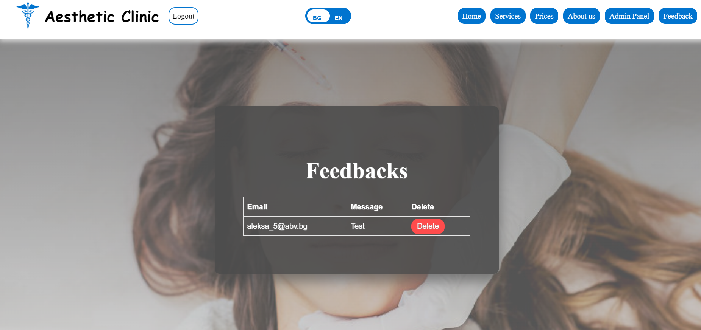

### Интернационализация

При натискане на бутона за смяна на езика, всяка страница се превежда. Актуализацията на бутона се осъществява чрез JavaScript.


### Responsive
Всички страници са Responsive, т.е. автоматично се адаптират към различни размери на екрана. Падащото меню, което се отваря при клик, е реализирано с помощта на JavaScript.

