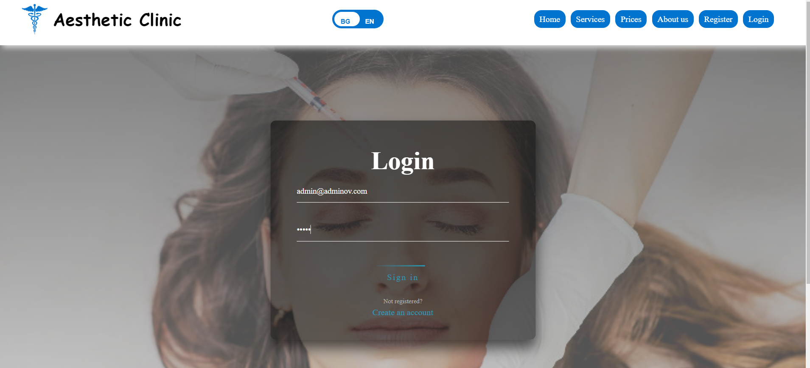
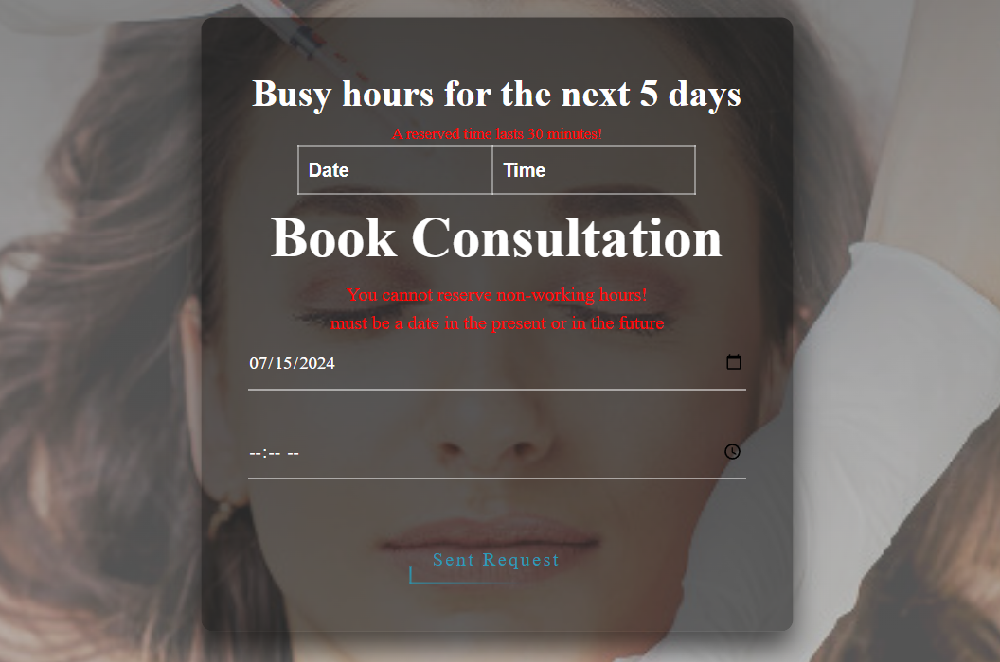
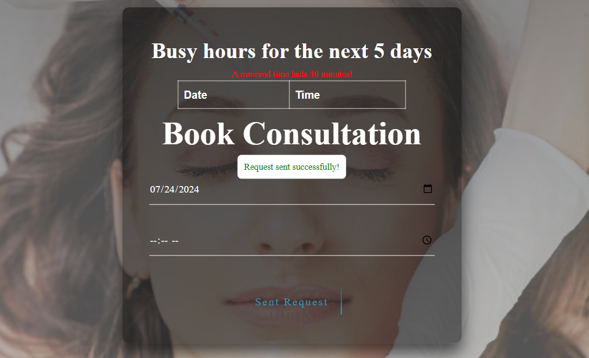
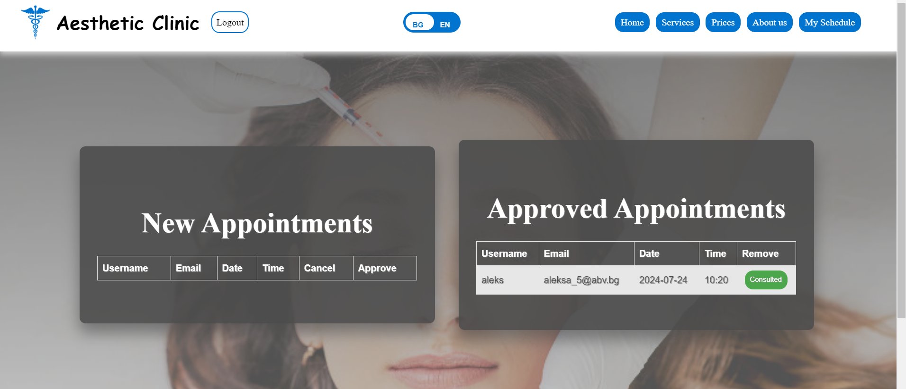
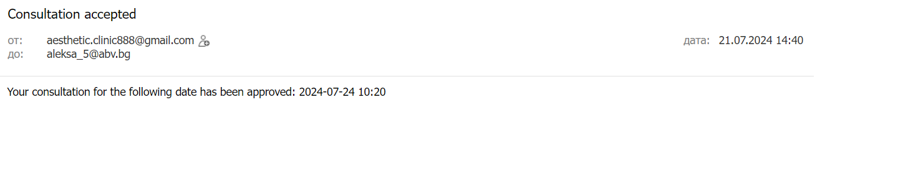

 # Aesthetic Clinic -  Spring MVC Application.
### Този проект представлява уебсайт за естетична клиника, който предоставя лесен начин за запазване на часове, преглед на запазените часове и одобрение на часовете от докторите. Сайтът е разработен с цел да улесни клиентите и да оптимизира процеса на резервация и управление на часовете.


## Външни API

Проектът консумира външно АPI, което предоставя важна функционалност:

1. **[API за валутните курсове](https://www.exchangerate-api.com/)**:   
Това API предоставя инфорамация за валутните курсове, чрез него цените на процедурите, показани в евро са винаги актуални.
За да го използвате трябва да  направите регистрация и да вземете ключ за апи-то.
Сложете ключа в environment variables в средата за разработка с този ключ: EXCHANGE_RATE_API_KEY

## Вътрешен микросървис
Проектът включва и собствен микросървис.
Важно е да сложите в environment variables този ключ FEEDBACKS_API_KEY със стойността, която ще зададете в микросървиса.
Повече информация за микроървиса можете да намерите **[тук](https://github.com/Aleksandra-Ilieva/SoftniFeedbackMicroservice)**:

## Environment variables
За да стартирате проекта, трябва да  добавите следните Environment variables в средата за разбработка:
## Конфигурация за базата данни
````
За връзка с базата данни:
spring.datasource.username=${db_username}
spring.datasource.password=${db_password}
spring.datasource.url=${db_dataUrl}/clinic?useSSL=true&createDatabaseIfNotExist=true
Пример за локален url (db_dataUrl-jdbc:mysql://localhost:3306)

````
### Ако няма да изпозлвате MYSQL , моля променете и следните настройки в application.properties:
 Трябва да промените настройките за базата, с която ще работите
```
spring.datasource.driverClassName=com.mysql.cj.jdbc.Driver
spring.datasource.url=jdbc:mysql://localhost:3306/clinic?useSSL=true&createDatabaseIfNotExist=true
spring.jpa.properties.hibernate.dialect=org.hibernate.dialect.MySQL8Dialect

```

## Конфигурация за автоматичното изпращане на имейли
````
Всеки път след одобрение или отказ от доктора на заявка за запазване на час, получавате автоматичен имейл, затова трябва да
посочите в Environment variable от кой имейл искате да бъде изпратено събщението, а за парола се слага специален код, който се генерира (Ако използвате gmail първо се активира двуфакторна автентикация)
spring.mail.username=${email}
spring.mail.password=${email_password}

````
## Ако няма да изпозлвате gmail, моля променете и следните настройки в application.properties:
````

spring.mail.host=smtp.gmail.com
spring.mail.port=587
spring.mail.username=${email}
spring.mail.password=${email_password}
spring.mail.properties.mail.smtp.auth=true
spring.mail.properties.mail.smtp.starttls.enable=true

````


# Tech stack
#### 1.Java 17
#### 2.JavaScript 
#### 3.Thymeleaf 
#### 4.HTML 
#### 5.CSS 
Всички остнали зависимости и библиотеки можете да  намерите в build.gradle


# За проекта
### Home page
Това е началната страница, която всеки потребител (включително нерегистриран) може да достъпи и види.
Тя съдържа навигационно меню , няколко секции и footer. Чрез бутна bn/en, потребителят може да избира между български 
или английски език.


### Services page
Това е страницата с услугите, може да се достъпи от всеки потребител (включително нерегистриран). В нея се виждат
услугите, които клиниката предлага. 


### Prices page
Това е ценовата страницата, може да се достъпи от всеки потребител (включително нерегистриран). В нея се виждат
цените на услугите, те се пазят в базата данни, като при стартиране на приложението се чете csv файл, който се намира в 
ресурсите на проекта. Цените се четат в долари, а API-то, което
споменахме по-рано: **[API за валутните курсове](https://www.exchangerate-api.com/)**:, се използва за трансформация на цените от долари в евро.
Всеки ден в 12:00 часа, с помощта на scheduler-а "ExchangeRateUpdaterScheduler", се правят заявки  към API-то и се обновява инфомрацията за курса в базата.


### About us page 
Това е информационна страница, може да се достъпи от всеки потребител (включително нерегистриран). В нея може да се види, повече
информация за клиниката.


### Register page 
Потребителя се регистрира в сайта чрез следната форма.Има валидации на Frontend  и  Backend.
### Валидации на Frontend:
- Html-a проверява полетата да не са празни.
- Html-a валидира имейла. 
### Валидации на Backend :
- Валидира имейл
- Проверява дали вече няма същестуващ регистриран имейл или потребителско име
- За всяко поле се проверява за нулева стойност или празна.
- Проверява дали паролата и потвърдената парола са еднакви
  
Пример за валидация чрез  анотация,с която се проверява за вече регистирано потребителско име.
  

### Login page 
След регистрация сме пренасочени към login формата, чрез която се влиза с имейл и парола.

### С помощта на Spring Security, ( src/main/java/org/example/softunifinalproject/config/SecurityConfig.java), правим автентификацията на потребителя, и при грешна парола или имейл се получава следното съобщение.


### При стартиране на приложението, в базата данни се регистрира един потребител, с администраторски права, който получава всички роли.(за паролата и имейла -> src/main/java/org/example/softunifinalproject/init/DbInitAdminAndRoles.java)
Запазва се администратора и всички роли, ако вече не са били запазени.



Ако регистрирате потребител, през сайта, той автоматично получава само роля USER.
За целта регистрирам потребител с този имейл -> aleksa_5@abv.bg

## Login as admin


Регистрираме потребител, който ще заеме ролята на доктор, която администратора трябва да му я даде.


Администратора въвежда името и имейла и задава желанта роля, след бутона запзване, ролята е зададена успешно.


Валидация за същестуваща роля


  Валидация за грешен имейл или парола


## Login as normal user
Потребителят може да запази час.
### Има следните валидации чрез анотации и javaScript:
- Дата трябва да е текущата или в бъдещето.
- Дата трябва да е в делничен ден 
- Часът трябва да е между 9 и 18
- Потребителят може да види всички запзени часове за 5 дни напред, както своите, така и на останалите потребители, за да избере подходящ незапазен час.
- 1 запазен час трае 30 минути
- Потребителят може да има до 3 запзени часа.




### Успешно изпратена заявка за час, която доктора може да одори или откаже.


## Login as doctor
След като потребителят, е изпратил заявка за час, доктора може да я одобри или откаже. А потребителят ще получи автоматичен имейл.

- След отказ заявката се изтрива.
- След одобрение:



## Login as normal user
След одобрение, потребителят вижда че има заети часове


В страницата Моят профил, потребителят вижда своите часове, може да откаже запазен час, 2 часа преди започването.


Успешно отказан час


## Login as doctor
При клик на бутона Консултиран, записа изчезва, но не се изтрива от базата. На всеки два часа с помощта на scheduler,
всички консултирани записи се изтриват от базата.(src/main/java/org/example/softunifinalproject/config/CleanupScheduler.java)


### Contact Us Page
- Потребител гост, може да изпрати запитване, след като попълни формата


- Ако потребителят има акаунт и е влезнал, имейла му се попълва автоматично.
  

- Успешно изпратено съобщение


## Login as Admin
Съобщението се обработва от микросървиса, който споменахме по-рано.
 
###  Администартора може да изтрие или да отговори ръчно на дадено запитване.


### Интернационализация
При натискане на бутона за смяна на езика, всяка страница се превежда, за промяната на бутона при смяна на езика
е използван javaScript


### Responsive
Всички страници са responsive, за падащото меню, което се отваря при клик е използван javaScript
