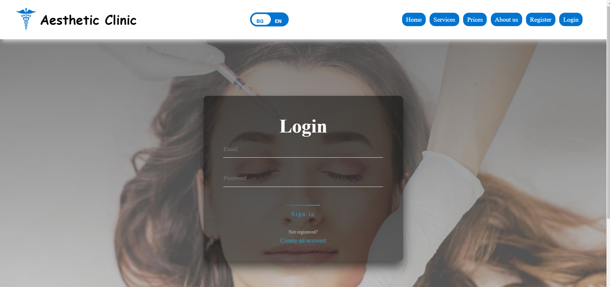

 # Aesthetic Clinic -  Spring MVC Application.
### Този проект представлява уебсайт за естетична клиника, който предоставя лесен начин за запазване на часове, преглед на запазените часове и одобрение на часовете от докторите. Сайтът е разработен с цел да улесни клиентите и да оптимизира процеса на резервация и управление на часовете.


## Външни API

Проектът консумира външно АPI, което предоставят важна функционалност:

1. **[API за валутните курсове](https://www.exchangerate-api.com/)**:   
Това API предоставя инфорамация за валутните курсове, чрез него цените на процедурите, показани в евро са винаги актуални.
За да го използвате трябва да си направите регистрация и да вземете ключ за апи-то.
Сложете ключва си в environment variables в средата за разработка с този ключ: EXCHANGE_RATE_API_KEY

## Вътрешен микросървис
Проектът включва и собствен микросървис, който предоставя важна функционалност:
Важно е да сложите в environment variables този ключ FEEDBACKS_API_KEY.
Повече информация за микроървиса можете да намерите **[тук](https://github.com/Aleksandra-Ilieva/SoftniFeedbackMicroservice)**:

## Environment variables
За да стартирате проекта, трябва да си добавите следните Environment variables в средата за разбработка:
## Конфигурация за базата данни
````
За връзка с базата данни:
spring.datasource.username=${db_username}
spring.datasource.password=${db_password}

````
### Ако няма да изпозлвате MYSQL , моля променете и следните настройки в application.properties:
 Трябва да промените настройките за базата, с която ще работите
```
spring.datasource.driverClassName=com.mysql.cj.jdbc.Driver
spring.datasource.url=jdbc:mysql://localhost:3306/clinic?useSSL=true&createDatabaseIfNotExist=true
spring.jpa.properties.hibernate.dialect=org.hibernate.dialect.MySQL8Dialect

```

## Конфигурация за автоматичното изпращане на имейли
````
Всеки път след одобрение или отказ от доктора на заявка за запазване на час, получавате автоматичен имей, затова трябва да
посочите в Environment variable от кой имейл искате да бъде изпратено събщениетп, а за парола се слага специален код, който се генерира (Ако използвате gmail първо се активира двуфакторна автентикация)
spring.mail.username=${email}
spring.mail.password=${email_password}

````
## Ако няма да изпозлвате gmail, моля променете и следните настройки в application.properties:
````

spring.mail.host=smtp.gmail.com
spring.mail.port=587
spring.mail.username=${email}
spring.mail.password=${email_password}
spring.mail.properties.mail.smtp.auth=true
spring.mail.properties.mail.smtp.starttls.enable=true

````


# Tech stack
#### 1.Java 17
#### 2.JavaScript 
#### 3.Thymeleaf 
#### 4.HTML 
#### 5.CSS 
Всички остнали зависимости и библиотеки можете да ги намерите в build.gradle


# За проекта
### Home page
Това е началната страница, която всеки потребител (включително нерегистриран) може да достъпи и види.
Тя съдържа навигационно меню (което е sticky), няколко секции и footer. Чрез бутна bn/en, потребителят може да избира между български 
или английски език.


### Services page
Това е сървис страницата, може да се достъпи от всеки потребител (включително нерегистриран). В нея можем да видим
услугите, които клиниката предлага. 


### Prices page
Това е ценовата страницата, може да се достъпи от всеки потребител (включително нерегистриран). В нея можем да видим
цените на услугите, те се пазят в базата данни, като при стартиране на приложението се чете csv файл, който се намира в 
ресурсите на проекта, ако таблицата за цените ни е празна, те ще се налеят в базата. Цените се четат в долари, а API-то, което
споменахме по-рано: **[API за валутните курсове](https://www.exchangerate-api.com/)**:, го използваме за да покажем цените в евро, но за да ги покажем изпозлваме курса на еврото от посоченото API, което го запзваме в базата.
Всеки ден в 12:00 часа, с помощта на scheduler-а "ExchangeRateUpdaterScheduler", се обръщаме към API-то и обяновяваме инфомрацията за курса в базата.


### About us page 
Това е about us страницата, може да се достъпи от всеки потребител (включително нерегистриран). В нея можем да видим повече
информация за клиниката.


### Register page 
Потребителя се регистрира в сайта чрез следната форма.Имаме валидации и в html-a, и на сървъра , като сме използвали custom анотации.
Имаме следните валидации при регистрация:
1. Html-a проверява полето да не е празно, за да не прави допълнителни заявки към сървъра 
2. 2.Html-a проверява дали имейла съдържа основните неща, който един имейл трябва да има
3. Сървъра(backend-a):
- Валидира имейл
- Проверява дали вече няма същестуващ регистриран имейл
- Проверява дали няма същестуващо потребителско име
- За всеки input се проверява още един път да не би да е null или blank, освен че на html-a вече е проверено един път
- Проверява дали паролата и потвърдената парола са еднакви
  
Пример за валидация чрез custom анотация,с която разбираме, че вече има такова регистрирано потребителско име.
  

### Login page 
След регистрация сме пренасочени към login формата, там трябва да влезем с имейла и паролата, с който сме се регистрирали.

### С помощта на Spring Security, (можете да го разгледате конфигурацията на следния път : src/main/java/org/example/softunifinalproject/config/SecurityConfig.java), правим автентификацията на потребителя, и ако е въвел грешен имейл или парола получаваме следното съобщение:

